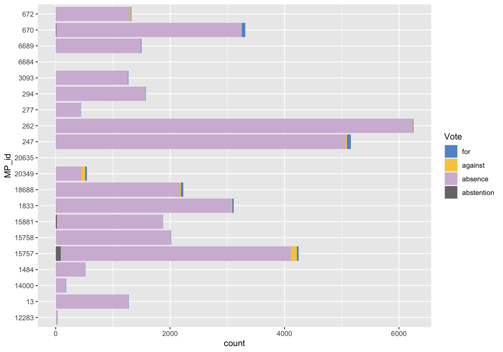
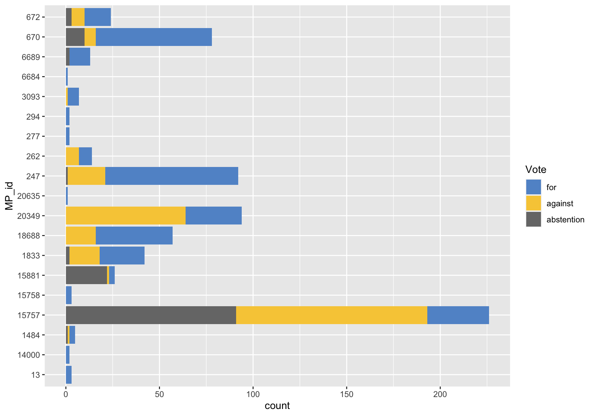
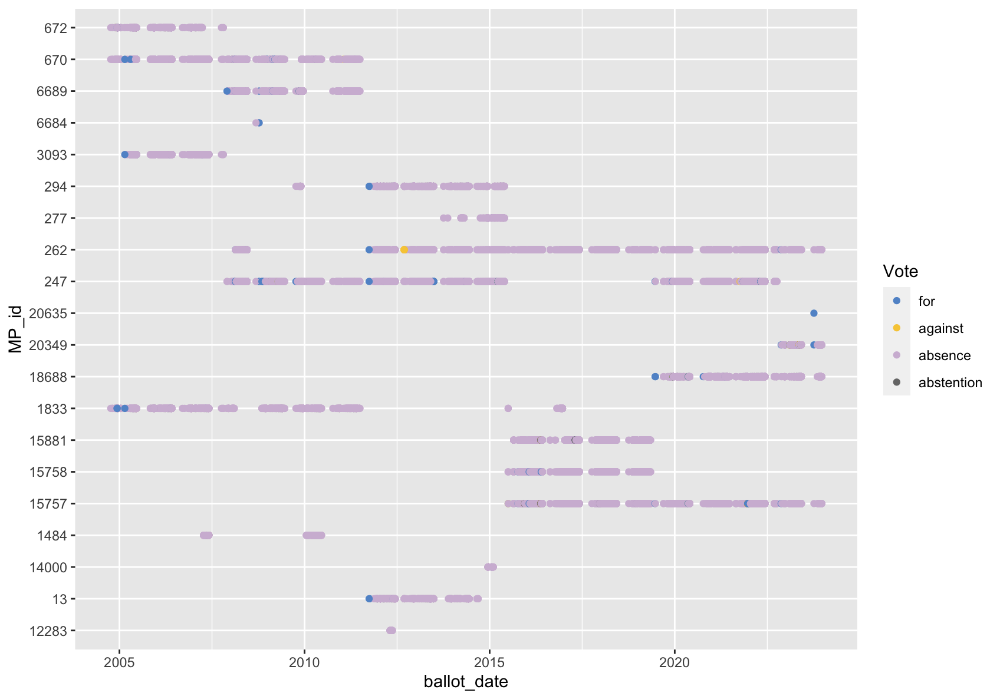
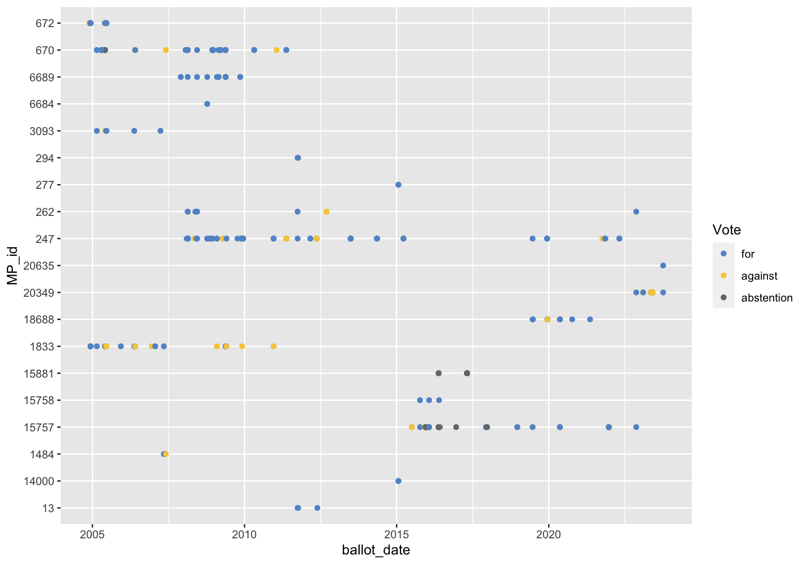

# A First Glance at _nordatlantisk-ft_

## Introduction

There are 179 MPs in Folketinget, the parliament of Denmark. But only 175 of them are elected in Denmark proper, while the remaining four seats are guaranteed for the so-called North Atlantic MPs from Greenland and the Faroe Islands, which both are autonomous members of the Danish Realm today after being under Danish colonial rule for centuries.

## Dataset

_nordatlantisk-ft_ is compiled from data available on Folketingets Open Data platform[^1] and comprises voting records of Northatlantic MPs. As per January 12, 2024, this includes records of `9469` ballots in Folketinget. See [`/docs/codebook.md`](docs/codebook.md) for details and refer to Berntzen et al. 2019[^berntzen] for background information on Folketingets open data ecosystem.

[^berntzen]: Berntzen, Lasse, Marius Johannessen, Kim Andersen, and Jonathan Crusoe. 2019. “Parliamentary Open Data in Scandinavia.” Computers 8 (3): 65. <https://doi.org/10.3390/computers8030065>.

## MPs

This dataset contains votes cast by Greenlandic and Faroese MPs since 2004. There have been twenty individual politicians from Greenland or the Faroe Islands who served as MPs in the time frame covered by Folketinget's Open Data Platform. Twelve of them have been elected in Greenland and eight in the Faroe Islands.

| Surname(s)          | First name(s) | MP ID | Origin | Party      |
| ------------------- | ------------- | ----- | ------ | ---------- |
| Olsvig              | Sara          | 13    | GL     | IA         |
| Lund Olsen          | Johan         | 277   | GL     | IA         |
| Jakobsen            | Doris         | 294   | GL     | SIU        |
| Johansen            | Lars-Emil     | 670   | GL     | SIU        |
| Kleist              | Kuupik        | 672   | GL     | IA         |
| Rossen              | Sofia         | 1484  | GL     | IA         |
| Henningsen Heilmann | Juliane       | 6689  | GL     | IA         |
| Nielsen             | Nick          | 14000 | GL     | SIU et al. |
| Chemnitz            | Aaja          | 15757 | GL     | IA         |
| Hammond             | Aleqa         | 15758 | GL     | SIU et al. |
| Høegh-Dam           | Aki-Matilda   | 18688 | GL     | SIU        |
| Olsen               | Markus E.     | 20635 | GL     | SIU        |
| Joensen             | Edmund        | 247   | FO     | B          |
| Arge                | Magni         | 15881 | FO     | E          |
| Hoydal              | Høgni         | 1833  | FO     | E          |
| Johannesen          | Axel          | 12283 | FO     | C          |
| Skaale              | Sjúrður       | 262   | FO     | C          |
| á Fríðriksmørk      | Annita        | 6684  | FO     | E          |
| Kallsberg           | Anfinn        | 3093  | FO     | A          |
| Falkenberg          | Anna          | 20349 | FO     | B          |

## Political Parties

Since 2004, Greenlandic MPs have belonged to two political parties while MPs from Faroe Islands were members of four different political parties. They are listed below with additional information on their positions from the ParlGov dataset[^2].

| Party | Full Name         |    Party Family     | Origin | Left-Right | State-Market | Liberty-Authority | Anti-Pro EU |
| :---- | :---------------- | :-----------------: | :----: | :--------: | :----------: | :---------------: | :---------: |
| IA    | Inuit Ataqatigiit | Communist/Socialist |   GL   |    1.3     |     1.4      |         3         |     3.3     |
| SIU   | Siumut            |  Social Democracy   |   GL   |    3.3     |     3.5      |        3.5        |     8.1     |
| A     | Fólkaflokkurin    |    Conservative     |   FO   |    7.4     |     6.4      |        6.9        |     7.9     |
| B     | Sambandsflokkurin |    Conservative     |   FO   |    7.4     |     6.4      |        6.9        |     7.9     |
| C     | Javnaðarflokkurin |  Social Democracy   |   FO   |    3.3     |     3.5      |        3.5        |     8.1     |
| E     | Tjóðveldi         | Communist/Socialist |   FO   |    1.3     |     1.4      |         3         |     3.3     |

## Sample Plots

The following sample plots were generated from [`./analysis/example_plots.R`](./analysis/example_plots.R) using `ggplot2` with the data available on January 12, 2024.

### Votes Per MP

### Votes Per MP Without Absences

### Votes Per MP Over Time

### Votes Per MP Over Time Without Absences

# References

[^1]: Folketinget. 2024. “Folketingets Åbne Data.” <https://oda.ft.dk>.
[^2]: Döring, Holger, Constantin Huber, and Philip Manow. 2022. “ParlGov 2022 Release.” Harvard Dataverse. <https://doi.org/10.7910/DVN/UKILBE>.
